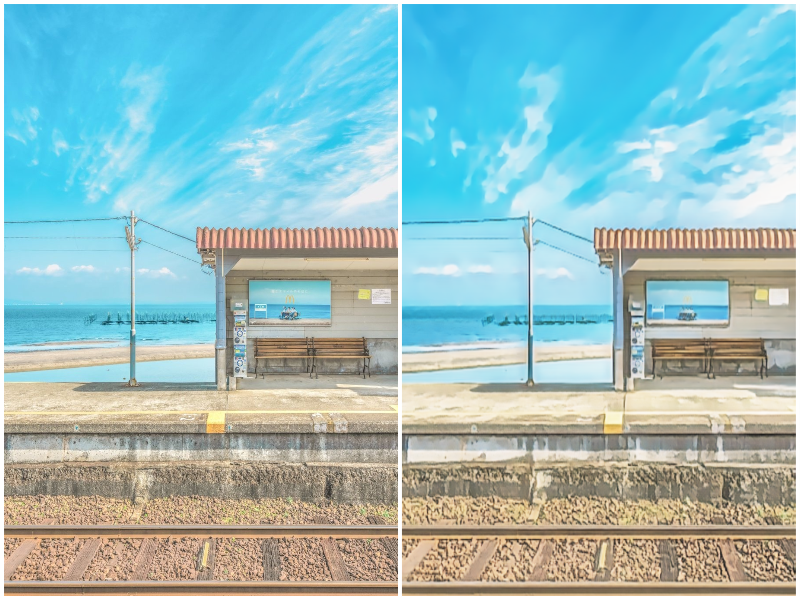
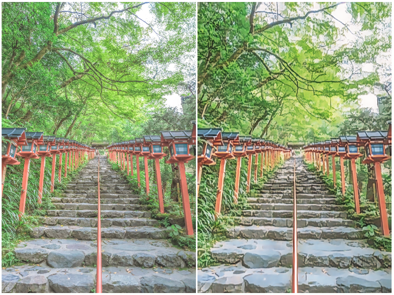
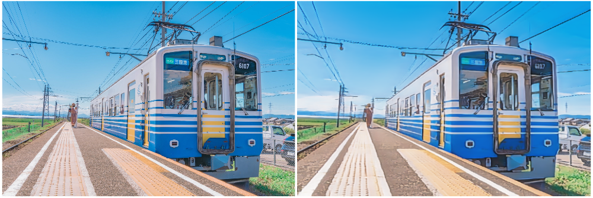
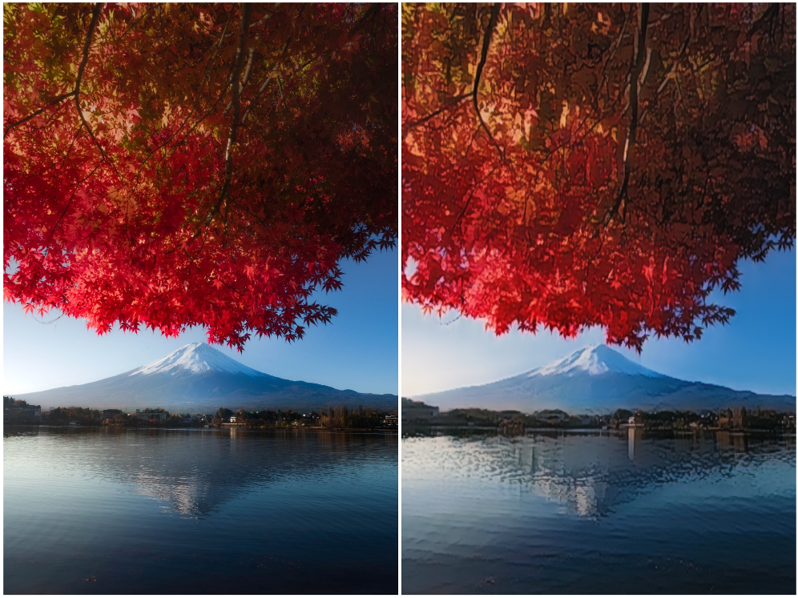
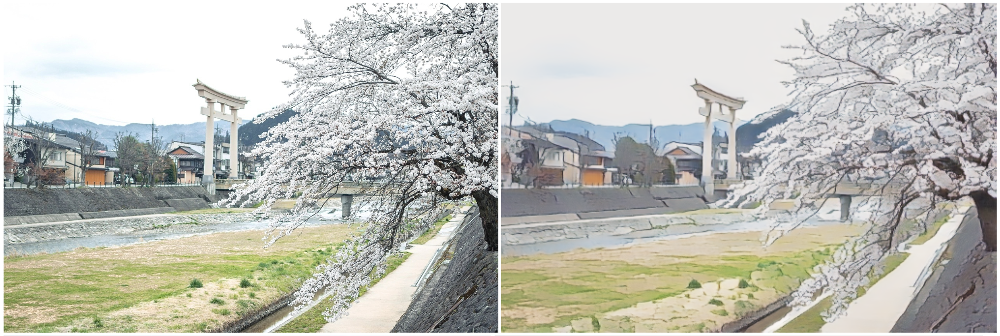
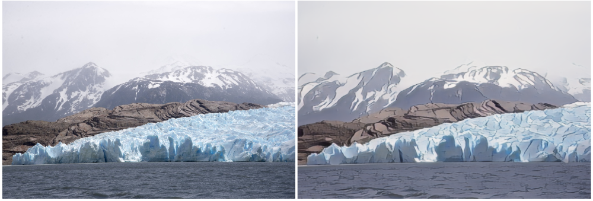

# [AnimeGANv3](https://github.com/TachibanaYoshino/AnimeGANv3) Web Demo

### [Link: ](https://xandrchris.github.io/Tf.js_Demos/AnimeGAN-v3) https://xandrchris.github.io/Tf.js_Demos/AnimeGAN-v3
#### This is [web demo](https://xandrchris.github.io/Tf.js_Demos/AnimeGAN-v3) for [AnimeGANv3](https://github.com/TachibanaYoshino/AnimeGANv3) Hayao and Shinkai Models using Tensorflow js and tfjs-Tflite API.
You can visit [official AnimeGANv3 repo](https://github.com/TachibanaYoshino/AnimeGANv3) for more information about it.

### Some Results
#### Using Shinkai Model

#### Using Hayao Model

### Acknowledgments
- [Asher Chan](https://github.com/TachibanaYoshino) for [AnimeGANv3](https://github.com/TachibanaYoshino/AnimeGANv3) models.
- [Tfjs](https://tensorflow.org/js)
